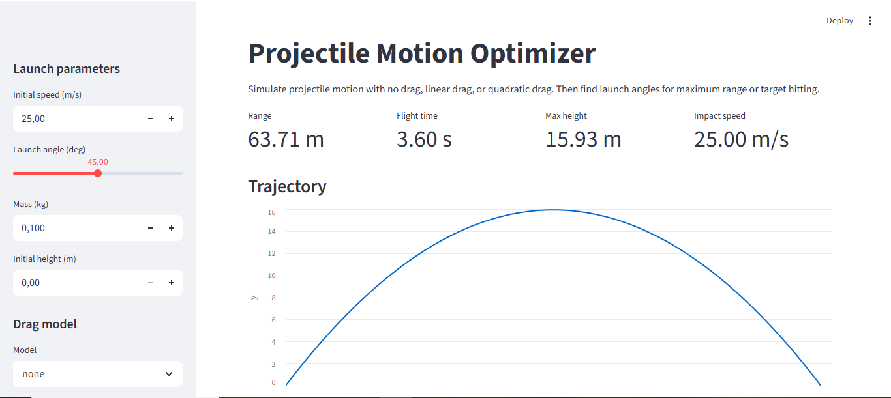

# Projectile Motion Optimizer

Projectile Motion Optimizer is a Python and Streamlit engineering simulation tool that models projectile motion and finds launch angles for maximum range or target hitting.

The project combines physics, numerical methods, optimization, visualization, and automated testing.

## Screenshot

## Problem

In ideal school physics, projectile motion is usually modeled as a perfect parabola without air resistance. In real life, air resistance changes the range, flight time, maximum height, and optimal launch angle.

This project shows how different physical assumptions affect the trajectory and helps find the best launch angle for a target.

## Project Benefit

This project can be useful for:

- learning projectile motion through interactive simulation
- comparing ideal and realistic physics models
- understanding how air resistance affects engineering calculations
- estimating launch angles for target hitting
- building intuition for physics-based software tools

## Algorithms and Physics

The simulator uses the state vector:

    [x, y, vx, vy]

where:

- x, y are position coordinates
- vx, vy are velocity components

The system of differential equations is:

    dx/dt = vx
    dy/dt = vy
    dvx/dt = ax
    dvy/dt = ay

The project supports three physical models.

### 1. No Drag

    ax = 0
    ay = -g

This is the ideal school physics model.

### 2. Linear Drag

    ax = -beta * vx
    ay = -g - beta * vy

Linear drag assumes air resistance is proportional to velocity.

### 3. Quadratic Drag

    speed = sqrt(vx^2 + vy^2)

    ax = -gamma * speed * vx
    ay = -g - gamma * speed * vy

Quadratic drag is more realistic for many real-world projectiles because air resistance grows with the square of velocity.

## Numerical Method

The project uses the fourth-order Runge-Kutta method, also known as RK4, to simulate the trajectory.

RK4 is more accurate than a simple Euler method and is commonly used for solving differential equations numerically.

## Optimization

The project uses grid search to:

- find the angle with maximum range
- find one or more angles that hit a target distance
- compare low and high trajectories for the same target

For example, the same target can often be reached using a low-angle trajectory or a high-angle trajectory.

## Features

- No-drag projectile simulation
- Linear drag simulation
- Quadratic drag simulation
- RK4 numerical integration
- Ground-impact interpolation
- Range calculation
- Flight time calculation
- Maximum height calculation
- Impact speed calculation
- Maximum range angle search
- Target-hitting angle search
- Streamlit web interface
- Automated tests with pytest

## Project Structure

    projectile-motion-optimizer/
    ├── README.md
    ├── requirements.txt
    ├── pyproject.toml
    ├── .gitignore
    ├── run.py
    ├── src/
    │   └── projectile_optimizer/
    │       ├── __init__.py
    │       ├── constants.py
    │       ├── models.py
    │       ├── physics.py
    │       ├── simulator.py
    │       ├── metrics.py
    │       ├── optimizer.py
    │       └── app.py
    ├── tests/
    │   ├── test_physics.py
    │   ├── test_simulator.py
    │   ├── test_metrics.py
    │   └── test_optimizer.py
    ├── examples/
    │   ├── run_basic_simulation.py
    │   ├── compare_drag_models.py
    │   └── find_target_angle.py
    ├── data/
    │   └── sample_targets.csv
    └── media/
        ├── screenshots/
        └── figures/

## Installation

Create a virtual environment:

    python -m venv .venv

Activate it on Windows PowerShell:

    .venv\Scripts\Activate.ps1

Install dependencies:

    pip install -r requirements.txt
    pip install -e .

## Run Tests

    python -m pytest

Expected result:

    18 passed

## Run the App

Main command:

    python run.py

Alternative command:

    python -m streamlit run src/projectile_optimizer/app.py

## Run Examples

    python examples/run_basic_simulation.py
    python examples/compare_drag_models.py
    python examples/find_target_angle.py

## Example Output

    Range: 63.71 m
    Flight time: 3.60 s
    Max height: 15.93 m
    Impact speed: 25.00 m/s

    none       | range=   63.71 m | time=  3.60 s
    linear     | range=   56.79 m | time=  3.50 s
    quadratic  | range=   43.65 m | time=  3.22 s

    Best angle: 19.50 degrees
    Range: 40.09 m
    Error: 0.09 m
    Hit: True
    All hit angles: [19.25, 19.5, 70.5, 70.75]

## Tech Stack

- Python
- NumPy
- Pandas
- Streamlit
- Pytest

## Summary

Projectile Motion Optimizer is a physics-based simulation tool that uses RK4 numerical integration to model projectile motion under no drag, linear drag, and quadratic drag. It calculates trajectory metrics, compares physical models, and finds launch angles for maximum range or target hitting. The project includes automated tests with pytest and a Streamlit web interface.
'@ | Set-Content -Encoding UTF8 "README.md"

git status
git add README.md
git commit -m "Improve README documentation"
git push